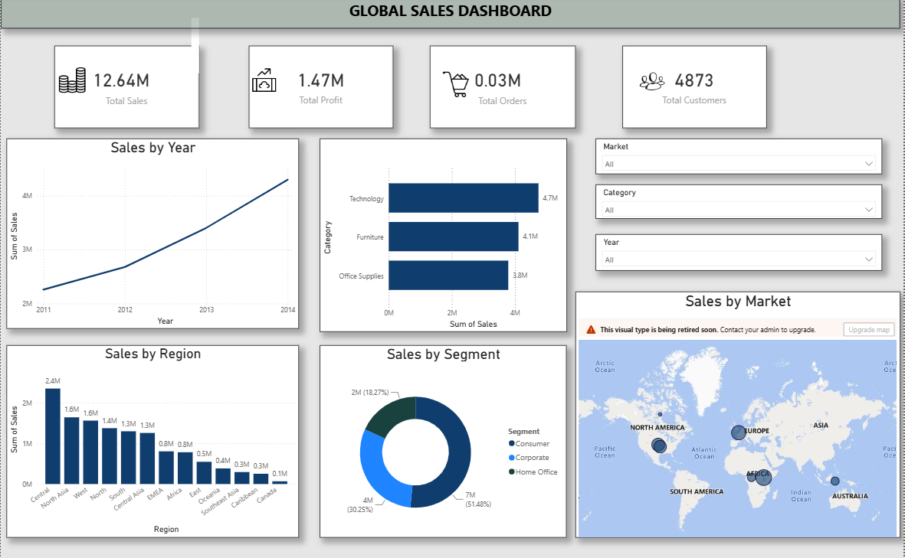

# Logistics & Retail Supply Chain Data Analysis

## 📦 Project Overview

This project is an end-to-end data engineering and analytics pipeline designed to analyze retail operations and logistics performance. The project transforms raw retail order data into structured, analysis-ready datasets using Python, SQL, ETL processes, and Microsoft Power BI.

The analysis focuses on understanding the relationship between sales, profitability, shipping operations, delivery time, shipping costs, shipping modes, and order priorities. These insights can support logistics planning, supply-chain monitoring, operational efficiency, and data-driven business decisions.

## 🎯 Project Objectives

- Clean and transform raw retail and shipment data
- Build a structured data pipeline using Python and SQL
- Analyze shipping and delivery performance
- Evaluate shipping costs across different shipping modes
- Analyze order priority and shipment characteristics
- Identify sales and profitability trends
- Calculate important logistics and business KPIs
- Prepare data for visualization and decision-making
- Develop a foundation for supply-chain performance analysis

## 🚚 Logistics & Supply Chain Analysis

The dataset contains important logistics-related fields including:

- Order Date
- Ship Date
- Shipping Days
- Shipping Cost
- Ship Mode
- Order Priority
- Customer ID
- Product ID
- Sales
- Quantity
- Profit
- Profit Margin

These fields can be used to analyze delivery duration, shipping costs, order urgency, operational patterns, and profitability.

## 📊 Key Performance Indicators

The project supports analysis of the following KPIs:

### Logistics KPIs
- Average Shipping Days
- Average Shipping Cost
- Shipping Cost by Ship Mode
- Shipping Performance by Order Priority
- Order Volume by Shipping Mode

### Business KPIs
- Total Sales
- Total Profit
- Profit Margin
- Total Orders
- Customer Count
- Sales by Year
- Sales by Market and Category

## 🔄 Data Pipeline

The project follows an end-to-end workflow:

Raw Data
↓
Data Cleaning & Validation
↓
Data Transformation
↓
Python ETL Processing
↓
SQL Database
↓
Exploratory Data Analysis
↓
KPI Analysis
↓
Power BI Visualization
↓
Business & Logistics Insights

## 🐍 Technologies Used

- Python
- Pandas
- SQL
- MySQL
- Microsoft Power BI
- ETL
- Data Cleaning
- Exploratory Data Analysis
- Data Visualization

## 📁 Project Structure

```text
Logistics-Retail-Supply-Chain-Data-Analysis/
│
├── data/
│   └── Raw datasets
│
├── transformed/
│   └── Cleaned and transformed datasets
│
├── scripts/
│   └── Python ETL and data-processing scripts
│
├── sql/
│   └── SQL database scripts and queries
│
├── images/
│   └── Dashboard and project visuals
│
├── README.md
├── requirements.txt
└── .gitignore
```
## 📈 Power BI Dashboard

The transformed retail data is analyzed and visualized using Microsoft Power BI.

### Dashboard Preview


